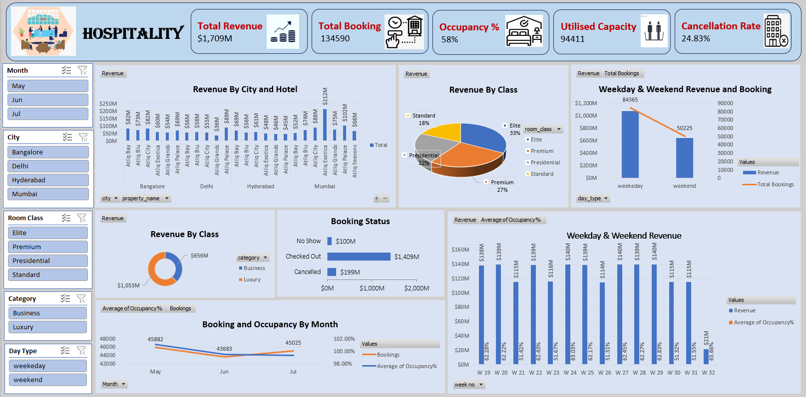

# Hospitality Dashboard (Excel)

This Excel dashboard provides key insights into the performance of a hospitality business over time. It is designed to help stakeholders monitor revenue, booking trends, occupancy, and cancellations by city, hotel, room class, and time period.

## 📊 Key Features
- **Dynamic Filtering** using slicers for Month, City, Room Class, Category, and Day Type
- **KPIs**: Total Revenue, Total Bookings, Occupancy %, Utilized Capacity, and Cancellation Rate
- **Visuals**:
  - Revenue by City and Hotel
  - Revenue by Room Class
  - Weekday vs Weekend Performance
  - Booking and Occupancy Trends
  - Booking Status Breakdown (Checked Out, Cancelled, No Show)

## 🛠 Tools Used
- Microsoft Excel
- Pivot Tables
- Slicers
- Bar, Pie, Combo Charts
- Conditional Formatting

## 📷 Dashboard Preview

> This is a personal project developed for practice and portfolio purposes.

